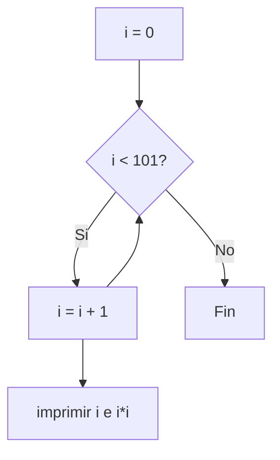
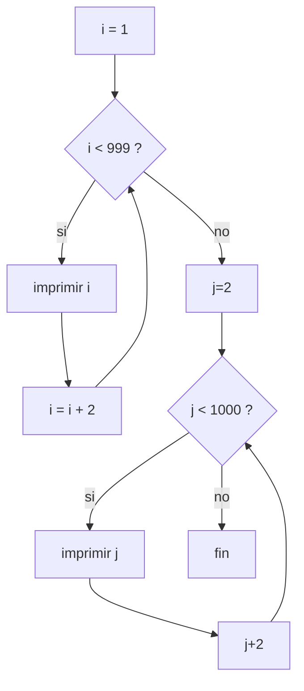
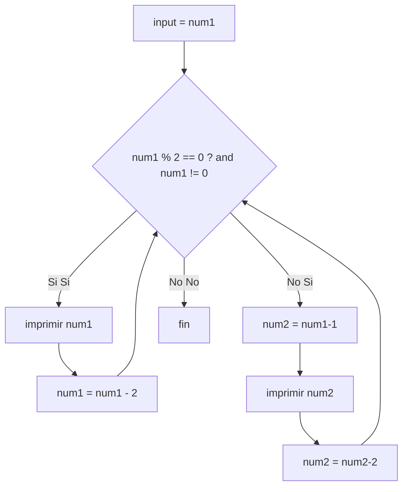

# reto-7 David Sotelo
## ejercicio 1
```python
i = 0 
while(i < 101): 
  print(i," ",i*i) 
  i = i + 1 
```

## ejercicio 2
```python
i = 1
while(i <= 999): 
  print(i) 
  i = i+2
j = 2
while(j<=1000):
  print(j)
  j = j+2 
```

## ejercicio 3
```python
num1 = int(input("ingrese un numero: "))
if num1%2 == 0:
    num1 = num1
else:
    num1 = num1-1
while(num1 >=2):
    print(num1)
    num1 = num1-2
```

## ejercicio 4
```python
i=25000000
j=18900000
an = 0
while(j<=i):
    j = j*1.03
    i = i*1.02
    an = an+1
print("en ", an, "años, la poblacion de B superara la de A")
```
## ejercicio 5
```python
n:int=int(input("ingrese un numero: "))
f=1
while(n > 1):
    f=f*n
    n=n-1
print(f)
```
## ejercicio 6
```python
import random
x=random.randint(1,100)
while True:
    try:
        n = int(input("ingresa un número entre 1 y 100: "))
        if n == x:
            print("Ganaste!")
            break 
        elif n > x:
            print(n, " es mayor")
        else:
            print(n, " es menor")
    except ValueError:
        print("")
```
## ejercicio 7
```python
def div(n):
    d=1
    while (d<=n):
        if n%d == 0:
            print(d)
        d=d+1
n : int = int(input("Ingrese un número entre 2 y 50: "))
while n < 2 or n > 50:
    print("El número ingresado está fuera del rango válido. Intente de nuevo.")
    n : int = int(input("Ingrese un número entre 2 y 50: "))
div(n)
```
## ejercicio 8
```python
def primo(n):
    if n <= 1:
        return False
    for i in range(2, int(n**0.5) + 1):
        if n % i == 0:
            return False
    return True

n=2
while n <= 100:
    if primo(n):
        print(n)
    n=n+1
```
